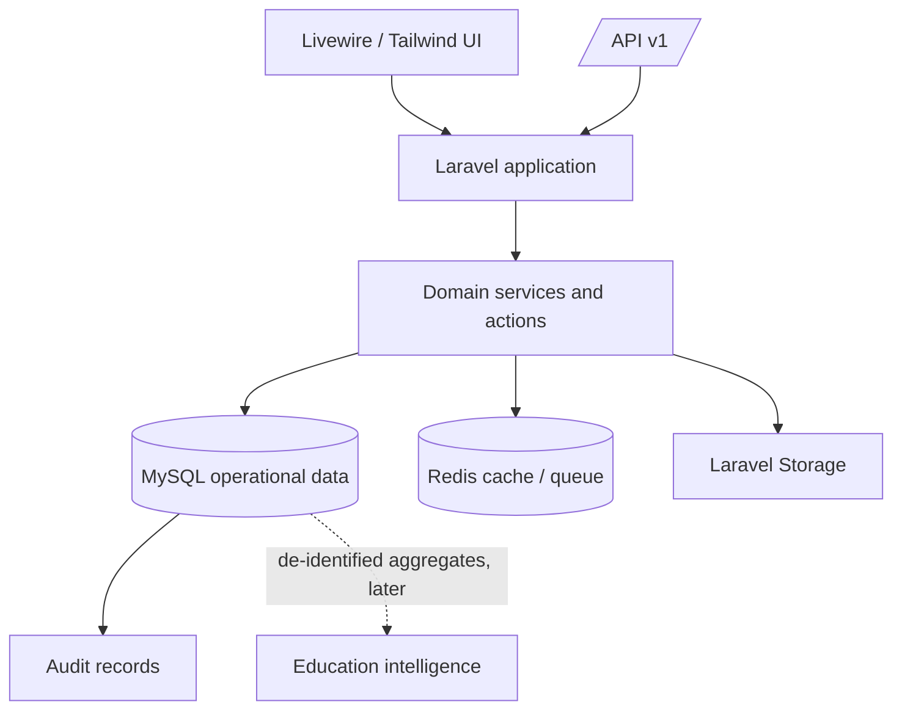

# EduBangla Architecture v1.0

## System overview

EduBangla is a modular Laravel application for Bangladesh schools. It begins with a single-school pilot but uses shared-database, row-scoped multi-tenancy from the first release. A school is the tenant boundary. The web application serves school administrators, teachers, students, parents, and staff; a versioned API enables future mobile and external integrations.



## Principles

1. Every tenant-owned record is scoped to a school, and tenant checks occur in queries and policies.
2. Livewire components, controllers, and views orchestrate requests only; domain services/actions own business rules.
3. Curriculum, assessment, grading, and promotion rules are configurable data, not scattered constants.
4. Student identity is persistent; yearly enrollment represents academic placement.
5. Critical operations are auditable, validated, authorized, transactional, and tested.
6. Pilot simplicity must not compromise future multi-school operation or API compatibility.

## Module boundaries

`School` owns tenant metadata and settings. `Academic` owns curriculum, years, class structure, subjects, and timetables. `Student` owns identity, guardians, documents, and enrollment history. `Attendance`, `Examination`, `Result`, `Finance`, `Communication`, and `Analytics` are separate domains. `Identity` provides authentication, roles, permissions, policies, and tenant context. No module directly encodes another module's calculation rules.

Suggested source layout after Laravel is initialized:

```text
app/Domain/{School,Academic,Student,Teacher,Attendance,Examination,Result,Finance,Communication,Analytics}/
app/{Actions,Policies,Jobs,Events,Http}/
database/{migrations,seeders,factories}/
tests/{Feature,Unit,Architecture}/
```

## Multi-school strategy

The initial model is one MySQL database with `school_id` on tenant-owned records. Central data includes users, permission definitions, curriculum definitions, and platform configuration. Tenant data includes school-specific memberships, academic operations, people, assessments, fees, notices, files, and audit events. Tenant context is resolved from the authenticated membership/request, never trusted from a user-supplied identifier. Repository/query scopes and Laravel Policies must enforce it together. A future tenant-per-database migration is possible only behind these domain boundaries.

## Authentication and authorization

Laravel authentication provides credential and session management. Sanctum protects API tokens. Spatie Permission provides role/permission assignment, supplemented by school memberships and Laravel Policies for record-level authorization. A user may have memberships in multiple schools, but each request has exactly one authorized school context. Parents can access only linked children; students only their own records; teachers only assigned academic work.

## Data flow

An authorized request resolves tenant context, validates input through a Form Request, calls an Action/Service, writes within a transaction where needed, records an audit event, and returns a UI/API response. Long-running work (report generation, notification delivery, imports) is placed on Redis-backed queues. Result calculation follows: raw marks → assessment weights → subject total → grade/point → GPA → publication/report card.

## API strategy

All external endpoints live under `/api/v1`. API resources expose only authorized, minimized fields. Sanctum, policies, throttling, validation, pagination, and stable error formats are mandatory. Changes that break public behaviour require a new API version. Initial domains: auth, schools, students, academic, attendance, exams, results, fees, notices, and analytics.

## Security and privacy

Use CSRF protection, secure password hashing, rate limits, validation, authorization policies, private file storage with authorized downloads, encrypted sensitive fields where justified, and immutable-style audit events. Do not centralize personally identifiable student data for analytics; future analytics uses validated, minimized, de-identified aggregates. Document backup, restore, retention, and incident procedures before production deployment.

## Scaling path

Phase 1 serves one school through a modular monolith. Redis queues/cache and stateless Laravel processes support horizontal web scaling. Indexed tenant keys and asynchronous jobs keep operational queries bounded. Later, read models/aggregates can serve benchmarking without coupling reporting workloads to transactional tables. Government integrations require an explicit data-governance ADR before activation.
