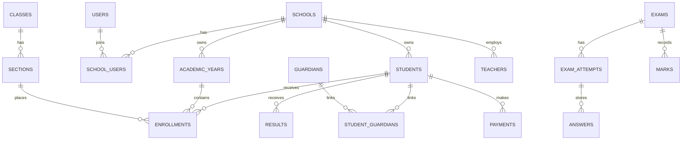

# Database Blueprint

## Ownership and relationships

`schools` is the tenant root. `users` is central identity; `school_users` records a user's school membership and role assignment. All tenant operations carry `school_id` either directly or through an unambiguous tenant-owned parent. Foreign keys and unique indexes must include the tenant where uniqueness is school-local (for example, `school_id, student_code`).

## Major entities

| Area | Tables / purpose |
| --- | --- |
| Central identity | `users`, Spatie `roles`, `permissions`, role/permission pivots, `school_users` memberships |
| School | `schools`, `school_settings`, `academic_years` |
| Academic | `curricula`, `classes`, `sections`, `groups`, `subjects`, `class_subjects`, `teacher_subjects`, `timetables` |
| People | `students`, `guardians`, `student_guardians`, `teachers`, `staff`, `student_documents` |
| Enrollment | `enrollments` with student, school, academic year, class, section, optional group, roll, status, and dates |
| Attendance | `attendance_sessions`, `student_attendance`, `teacher_attendance`; each record has date, optional period/subject, status, reason, recorder |
| Examination | `exam_types`, `exams`, `exam_schedules`, `question_banks`, `questions`, `question_options`, `exam_attempts`, `answers`, `marks` |
| Results | `assessment_structures`, `assessment_components`, `grade_rules`, `result_runs`, `results`, `result_subjects`, `promotions` |
| Finance | `fee_structures`, `student_fees`, `payments`, `payment_receipts` |
| Communication | `notices`, `notice_audiences`, `notifications` |
| Governance | `audit_logs`, `attachments`, future aggregate/report tables |

## Key modelling rules

- `students` contains a persistent school-owned identity; enrollment never overwrites academic history.
- `enrollments` must be unique per student, school, and academic year, subject to an explicit transfer/history policy.
- `marks` retains assessment provenance; published `results` are versioned outputs of a result run, not the only source of truth.
- `grade_rules` and assessment structures belong to a configurable curriculum/school context with effective dates.
- Online attempts retain schedule, started/submitted timestamps, server-calculated expiry, state, and idempotency key. Answers retain a question snapshot/version where required for reproducible grading.
- `audit_logs` records actor, school context, action, target type/id, timestamp, request metadata, and safe before/after summaries. Never log passwords or raw sensitive tokens.

## Required integrity and indexes

Use foreign keys, restrictive deletion rules for historical records, and soft deletion only where business recovery requires it. Index every `school_id`, common tenant/date filters, enrollment lookups, attendance date/status, exam schedule/attempt state, and payment due state. Use unique constraints for school-local codes, enrollment roll allocation within a placement, and one answer per attempt/question. Sensitive storage and retention choices need dedicated ADRs before implementation.
