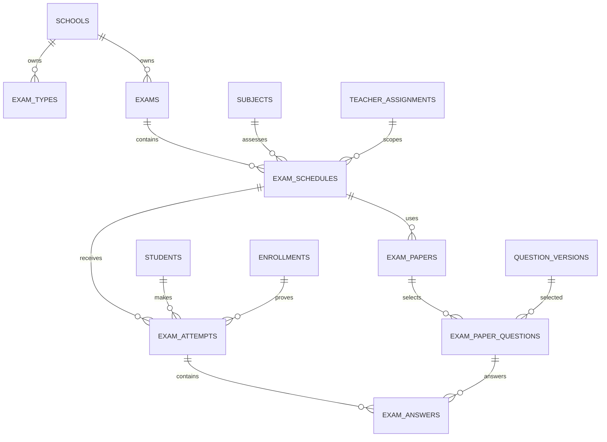

# Phase 5 Database Architecture

## ER overview

## Proposed tables

`exam_types`: `school_id`, name, code, status.  
`exams`: `school_id`, `academic_year_id`, `exam_type_id`, name, lifecycle status, published/locked timestamps, created_by.  
`exam_schedules`: `school_id`, `exam_id`, `subject_id`, `class_id`, `section_id`, nullable `group_id`, `subject_assignment_id`, `teacher_assignment_id`, `teacher_id`, date/time, duration, maximum marks, mode, room.  
`question_banks`: `school_id`, name, subject_id, curriculum/language metadata, status.  
`questions`: `school_id`, `question_bank_id`, stable key, type, topic, learning objective, difficulty, status.  
`question_versions`: `school_id`, `question_id`, immutable version, prompt, marks, language, answer configuration, created_by.  
`question_options`: `school_id`, `question_version_id`, option key/text, correctness metadata.  
`exam_papers`: `school_id`, `exam_schedule_id`, version, total marks, generated_at.  
`exam_paper_questions`: `school_id`, `exam_paper_id`, `question_version_id`, ordinal, marks.  
`exam_attempts`: `school_id`, `exam_schedule_id`, `exam_paper_id`, `student_id`, `enrollment_id`, attempt number, idempotency key, server expiry, started/submitted timestamps, status, score nullable.  
`exam_attempt_questions`: `school_id`, `exam_attempt_id`, ordinal, question version ID, prompt/options/marks snapshot.  
`exam_answers`: `school_id`, `exam_attempt_id`, `exam_attempt_question_id`, selected option, answer text, submitted timestamp, awarded marks nullable.  
`exam_marks`: `school_id`, `exam_schedule_id`, `student_id`, `enrollment_id`, optional question/attempt reference, marks, entered_by, corrected_by, timestamps.

## Integrity rules

Every table has a direct `school_id` and foreign keys use restrict-on-delete for historical records. Composite unique constraints should include school scope: exam code per school, schedule scope/date/time, paper question ordinal, student + schedule + attempt number, idempotency key per student/schedule, and one answer per attempt-question. Use explicit short names such as `exam_schedule_scope_unique` to remain under MySQL's 64-character identifier limit.

## Indexes

Index school + academic year, exam status, schedule date/class/section, teacher assignment, question subject/type/difficulty, attempt student/status/expiry and marks student/schedule. Avoid redundant single-column indexes where a composite index covers the query.

## Snapshot and deletion

An attempt receives immutable `exam_attempt_questions` snapshots at start. Question edits never rewrite an attempt. Exams, schedules, papers, attempts and marks are retained; destructive deletion is not part of Phase 5.

Phase 5A implements the examination foundation tables through migration `2026_08_29_200000_create_examination_foundation_tables`. Online attempt tables remain intentionally unimplemented.
Question options are tenant-scoped through `school_id` and uniquely keyed per version. Paper totals are recalculated transactionally after add/remove operations; examination lifecycle timestamps protect locked and published records.
